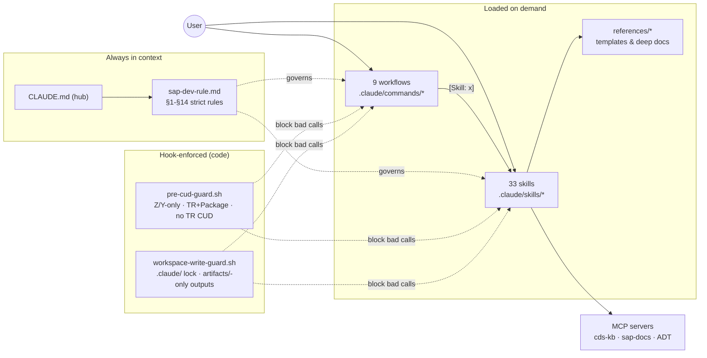
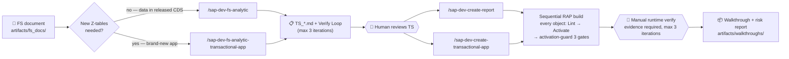

# 🚀 SAP ABAP Cloud Agent Workspace (Claude Code)


Pair-programming workspace for developing on **SAP BTP ABAP Environment** and **S/4HANA Cloud (Clean Core)** with Claude Code. It turns Claude into a governed SAP developer: 33 domain skills auto-activate by description, 9 slash-command workflows drive FS-to-deployed-code pipelines, an always-loaded rule file enforces Clean Core discipline, and `PreToolUse` hooks hard-block the riskiest operations in code — not just in prompt text.

> Sibling to `abap_antigravity_workspace` — same governance and domain knowledge, re-plumbed for Claude Code's native mechanics (Skill auto-discovery, slash commands, `CLAUDE.md` imports).

---

## 🧭 Architecture at a Glance





---

## ⭐ Recommended MCP Servers

Several skills (`find-released-cds-view`, `fs-logic-behavior-translator`, `fs-integration-api-analyzer`, `sap-fiori-apps-reference`, `atc-cloudification`, and rule §9's "verify a tool exists / use `ToolSearch`" guidance) call out to "whichever MCP server/tool your environment exposes" for SAP CDS/documentation search — they work without one, but are far faster and more accurate with these two connected:

| MCP Server | What it gives the Agent |
|---|---|
| **[cds-kb-mcp](https://github.com/dovoanhtruong/cds-kb-mcp)** | Semantic search across 7,355 released S/4HANA Cloud CDS views (`search_cds`, `get_cds_view`, `get_views_by_tag`, `get_taxonomy`) — powers `find-released-cds-view` and the Clean-Core-replacement checks in the FS-analysis skills, instead of the Agent guessing a CDS view name. |
| **[mcp-sap-docs](https://github.com/dovoanhtruong/mcp-sap-docs)** | Hybrid search over SAP Help Portal, SAP Accelerator Hub (OData/REST/SOAP APIs), the Fiori Apps Library, and Clean Core released-object data — backs the "search official SAP documentation before proposing an API/CDS replacement" steps required across the Consultant skills and workflows. |

Add both to your Claude Code MCP config (`claude mcp add` or your `.mcp.json`) — see each repo's README for the exact server command. Once connected, when a skill needs one, Claude Code will surface it as a tool to load via `ToolSearch` on first use.

---

## 📂 Workspace Directory Structure

```text
abap-agent-claudecode-workspace/
├── CLAUDE.md                       # 🧠 Hub file — always loaded; @imports the rule file below
├── .claude/
│   ├── rules/
│   │   └── sap-dev-rule.md         # 🛡️ 14 strict rules (Clean Core, Custom Only, TR, evidence, subagents, language, self-modification)
│   ├── skills/                     # 📚 33 skills, FLAT — auto-discovered & matched by description (catalog below)
│   │   └── <name>/SKILL.md          #    + references/ subfolders for heavy templates (loaded only when needed)
│   ├── hooks/                      # 🔒 Hard-enforced guardrails (PreToolUse) — code, not prompt text
│   │   ├── pre-cud-guard.sh         # Blocks non-Z/Y CUD, missing TR/Package, and any TR create/delete/modify
│   │   └── workspace-write-guard.sh # Locks .claude/ (open via user-created .claude/.unlock); new files → artifacts/ only
│   ├── settings.json               # Hook wiring
│   └── commands/                   # ⚙️ 9 workflows as slash commands (see Quick Start)
├── artifacts/                      # 📦 Single root for all input/output artifacts (gitignored)
│   ├── fs_docs/                     # Input Functional Specification (FS) documents
│   ├── technical_specifications/    # Technical Specifications (TS_*.md)
│   ├── scratchpads/                 # Drafts, progress ledgers, handoff notes (+ review/ for code reviews)
│   ├── walkthroughs/                # Deployment guides, testing & task checklists
│   ├── metadata_extensions/         # Generated Metadata Extension (DDLX) source, pending manual ADT creation
│   └── system_analysis/             # System/package analysis & audit reports
├── .gitignore
└── README.md                       # 📖 This file
```

---

## 📚 Skill Catalog (33, by category)

**🔎 FS Analysis / Consultant (7)** — `fs-data-model-extractor` (data model from FS: extract / design new Z-tables / trace lineage) · `fs-fiori-ui-elements-mapper` (FS layouts → Fiori Elements annotations + toolbar buttons) · `fs-logic-behavior-translator` (business rules → CDS vs Virtual Element vs Behavior Pool; status machine, numbering) · `fs-integration-api-analyzer` (FS integration specs → API design + payload mapping) · `fs-vision-extractor` (transcribe mockups/flowcharts/screenshots embedded in FS) · `document-markdown-converter` (binary FS → Markdown via MarkItDown) · `find-released-cds-view` (map a business field to its released Clean-Core CDS view).

**🧱 ABAP Cloud Foundations (10)** — `abap` (abaplint + Clean ABAP review, merged) · `abap-cloud` (3-tier model, language restrictions, released-API discovery) · `abap-cloud-migration` (classic → cloud code adaptation, wrapper pattern) · `atc-cloudification` (ATC cloud-readiness check variants) · `modern-abap-syntax` (VALUE/COND/REDUCE enforcement) · `abap-sql-amdp` (advanced SQL, AMDP, CDS table functions) · `abap-unit-testing` (test classes, test doubles, CDS/OSQL/RAP BO test environments) · `oo-design-patterns` (when-is-which-GoF-pattern-warranted decision table) · `released-abap-classes` (released class lookup by use case) · `abap-generative-ai` (ABAP AI SDK / ISLM completion API).

**⚙️ RAP & Services (6)** — `rap` (BDEF, EML, handlers/savers, draft, save sequence) · `rap-query-provider` (IF_RAP_QUERY_PROVIDER for custom entities; the "Query not fully covered" fix) · `rap-business-events` (event definition, binding, Event Mesh) · `cds-view-entities` (CDS data modeling, admin fields, compositions) · `odata` (service definition/binding, consumption, troubleshooting) · `badi-enhancement` (new BAdI framework, released BAdIs in Cloud).

**🔐 Platform & Security (4)** — `authorization-iam` (AUTHORITY-CHECK, DCL, RAP auth handlers, IAM apps/catalogs/roles) · `btp-abap-environment` (provisioning, ADT connectivity, communication management) · `btp-diagram-generator` (BTP solution diagrams as draw.io files) · `sap-fiori-apps-reference` (Fiori Launchpad URL generation, offline AppList fallback).

**🧭 Governance & Productivity (6)** — `activation-guard` (3-gate post-activation verification: log, active state, ripple check) · `naming-convention` (FPT project naming standards; explicit TS names win) · `scratchpad` (plan + progress ledger, single source of truth) · `handoff` (session-transition notes with ledger pointer) · `grill-me` (targeted requirement interviews, ≤3 rounds) · `caveman` (terse chat narration, never on code/reports).

---

## 🛠️ Core Components & How They Work

### 1. Skill Auto-Discovery (`.claude/skills/`)
Claude Code scans `.claude/skills/<name>/SKILL.md` and matches each skill's `description` frontmatter against your request — no manual router. Skills keep their body lean and push heavy templates (BDEF/handler skeletons, syntax guides, walkthroughs) into `references/` files that load only when actually writing that object — the same progressive-disclosure pattern across all 33.

### 2. Always-On Rules (`CLAUDE.md` → `.claude/rules/sap-dev-rule.md`)
`CLAUDE.md` `@imports` the rule file, so it's unconditionally in context every turn. The 14 sections cover: DEV-only assumption, consent + Z/Y-only + TR/Package discipline, CDS-read/EML-write standards, `artifacts/`-only outputs, activation-guard gates after every object mutation, Iron Laws (no improvising beyond the TS), Red Flags, evidence-based reporting ("Activated ≠ Correct"), MCP tool verification, token efficiency, evidence floor for user verification, subagent policy, language policy (chat VN · code EN), and self-modification rules (`.claude/` locked behind user-created `.unlock`).

### 3. Workflows as Slash Commands (`.claude/commands/`)
Each workflow is a phase-gated protocol: input validation gate (grill-me on gaps) → ledger-tracked build (activation-guard after every object) → evidence-based verify loop (max 3 iterations, then stop and ask) → walkthrough report. See Quick Start for all 9.

### 4. Hard-Enforced Guardrails (`.claude/hooks/`)
Prompt rules can be ignored; hooks can't. `pre-cud-guard.sh` fires on every call to any connected SAP MCP server matching `mcp__sap_<project>_dev__*` and blocks: non-Z/Y object CUD, object CUD without TR+Package, and any agent-driven create/delete/modify of a Transport Request itself. It's heuristic (regex over the tool payload) — tighten the field lookups once you've inspected one real call. `workspace-write-guard.sh` fires on `Write|Edit|NotebookEdit|Bash` and blocks: any change inside `.claude/` unless the **user** has manually created the sentinel `.claude/.unlock` (the agent is permanently blocked from creating that sentinel itself), and creation of new files outside `artifacts/` (editing existing files stays allowed). Hooks enforce "did this happen" — the rule file still governs "was it done well".

---

## 🚀 Quick Start

### First-time setup

1. Clone, then open the folder in Claude Code.
2. (Recommended) Connect the two MCP servers above, plus your SAP system's ADT MCP server (named `mcp__sap_<project>_dev__*` so the CUD guard covers it).
3. One-time venv for binary FS conversion: `python3 -m venv .venv_markitdown && ./.venv_markitdown/bin/pip install 'markitdown[all]'`.
4. Know the lock: if you ask Claude to modify `.claude/` (rules/skills/hooks), first run `touch .claude/.unlock`, and delete it when done.

### The 9 workflows

**Pipeline A — report/screen over existing released CDS data:**

```bash
# FS → Technical Specification
/sap-dev-fs-analytic artifacts/fs_docs/SAPER_2025_PM_FS.docx Z_INVENTORY_REPORT
# Review artifacts/technical_specifications/TS_*.md, then TS → activated RAP objects
/sap-dev-create-report ZREPORT_PM DEVK900123 artifacts/technical_specifications/TS_InventoryReport.md
```

**Pipeline B — brand-new transactional app (no existing Z-table/CDS):**

```bash
# FS → Technical Specification incl. DDIC Foundation design (tables/domains/number range/status machine)
/sap-dev-fs-analytic-transactional-app artifacts/fs_docs/SAPER_2025_ZBOM_FS.docx ZPRODX_ZBOM
# TS → DDIC Foundation + full RAP composition tree + OData binding
/sap-dev-create-transactional-app ZPRODX_ZBOM DEVK900124 artifacts/technical_specifications/TS_ZBom.md
```

**Maintenance & integration:**

```bash
# Root-cause + regression-safe fix (halts for your approval before touching code)
/sap-dev-bug-fix ZC_INVENTORY_REPORT "SO Type ZOR2: expected qty 10, got 0"

# Inbound API on Z_API_FWK (external system calls SAP)
/sap-dev-api-inbound CREATE_SALES_ORDER

# Outbound API via Z_API_FWK=>execute_api (SAP calls external system)
/sap-dev-api-outbound NOTIFY_WMS

# Deep-dive documentation of an existing object/package
/sap-dev-code-analysis ZPRODX_ZBOM "data flow + call graph"

# Strict advisory QA review (no auto-refactor)
/sap-dev-code-review ZCL_BOM_PROCESSOR "performance, security"
```

Every build workflow asks for anything missing (Package, TR, TS gaps) before touching the system, and refuses to mark work done without activation evidence.

---

## ⚙️ Notes for Developers

* **Relative paths** everywhere — the workspace moves between machines without breaking.
* **Adding a skill:** `touch .claude/.unlock`, drop `.claude/skills/<name>/SKILL.md` with `name` (= folder name) + `description` frontmatter, keep the body lean with heavy content in `references/`, then re-run the integrity check (frontmatter name = dir name; every `[Skill: x]` reference resolves) and delete `.unlock`. Claude Code picks it up automatically.
* **Audit trail:** the full skill/workflow/rule audit and upgrade history lives in `artifacts/system_analysis/skill_audit_*.md`.
* **Relationship to `abap_antigravity_workspace`:** ported from it, maintained separately — fixes do not auto-propagate between the two.
